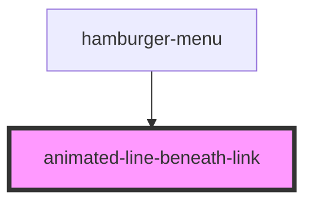

# animated-line-beneath-link

<!-- Auto Generated Below -->

## Properties

| Property | Attribute | Description | Type     | Default     |
| -------- | --------- | ----------- | -------- | ----------- |
| `text`   | `text`    |             | `string` | `undefined` |

## Dependencies

### Used by

- [hamburger-menu](../hamburger-menu)

### Graph

---

## Dependencies

### Used by

- [hamburger-menu](../hamburger-menu)

### Graph

---

## Dependencies

### Used by

 - [hamburger-menu](../hamburger-menu)

### Graph

----------------------------------------------

*Built with [StencilJS](https://stenciljs.com/) by the [ZTM](https://zerotomastery.io/) community*
