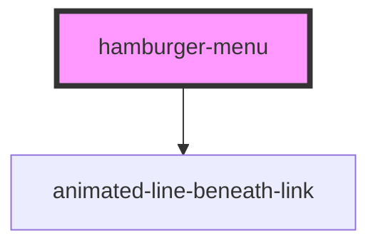

# hamburger-menu

<<<<<<< HEAD
<<<<<<< HEAD

<!-- Auto Generated Below -->

=======
<!-- Auto Generated Below -->

>>>>>>> 57992c79dcd5bfa494a7ef2b0ca504df91ac8f68
=======

<!-- Auto Generated Below -->

>>>>>>> 656732c19b6bf88235c43acb29466796798601fe
## Dependencies

### Depends on

- [animated-line-beneath-link](../animated-line-beneath-link)

### Graph
<<<<<<< HEAD
=======

<<<<<<< HEAD
>>>>>>> 57992c79dcd5bfa494a7ef2b0ca504df91ac8f68
=======

>>>>>>> 656732c19b6bf88235c43acb29466796798601fe

<<<<<<< HEAD
<<<<<<< HEAD
----------------------------------------------

*Built with [StencilJS](https://stenciljs.com/) by the [ZTM](https://zerotomastery.io/) community*
=======
---

_Built with [StencilJS](https://stenciljs.com/) by the [ZTM](https://zerotomastery.io/) community_
>>>>>>> 57992c79dcd5bfa494a7ef2b0ca504df91ac8f68
=======
----------------------------------------------

*Built with [StencilJS](https://stenciljs.com/) by the [ZTM](https://zerotomastery.io/) community*
>>>>>>> 656732c19b6bf88235c43acb29466796798601fe
