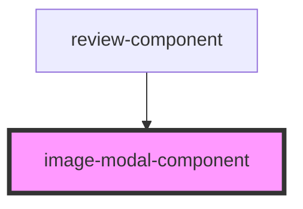

# image-modal-component

## Overview

This component takes the images from the review component and displays them through a modal. The modal is displayed when the user clicks on the review image.

<!-- Auto Generated Below -->

## Methods

### `open(url: any) => Promise<void>`

#### Returns

Type: `Promise<void>`

## Dependencies

### Used by

- [review-component](../review-component)

### Graph

---

_Built with [StencilJS](https://stenciljs.com/) by the [ZTM](https://zerotomastery.io/) community_
