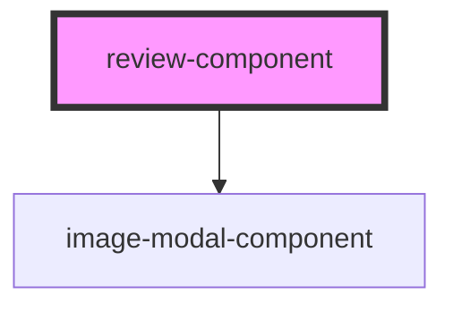

# review-component

## Overview

Developing a review component using StencilJS with content passed through slots. The review component also accepts prop values (required) including username, product name and rating. The contents in the component include

- Review title
- Review tags
- Review content/description
- Review images

This component also includes another component as it's dependency (image-modal-component). This dependency is introduced so as to display the images when they are clicked.
Appropriate styling is also carried out.

### Example

```HTML
<review-component username="Anderson" productname="Sony WH1000XM4" rating="4.5">
  <dl class="review-tags" slot="review-tags">
    <dt class="tag" slot="tag">Good Audio</dt>
    <dt class="tag" slot="tag">Improved features</dt>
  </dl>
  <p class="review-content" slot="review-content">
    Amazing pair of headphones for the masses. Well balanced audio with support for equalizer, sleek design, excellent noise cancellation and a number of features make it the king of headphones in the market
  </p>
  </review-component>
```

<!-- Auto Generated Below -->

## Properties

| Property      | Attribute     | Description | Type     | Default     |
| ------------- | ------------- | ----------- | -------- | ----------- |
| `productname` | `productname` |             | `string` | `undefined` |
| `rating`      | `rating`      |             | `number` | `undefined` |
| `username`    | `username`    |             | `string` | `undefined` |

## Dependencies

### Depends on

- [image-modal-component](../image-modal-component)

### Graph



---

_Built with [StencilJS](https://stenciljs.com/) by the [ZTM](https://zerotomastery.io/) community_
